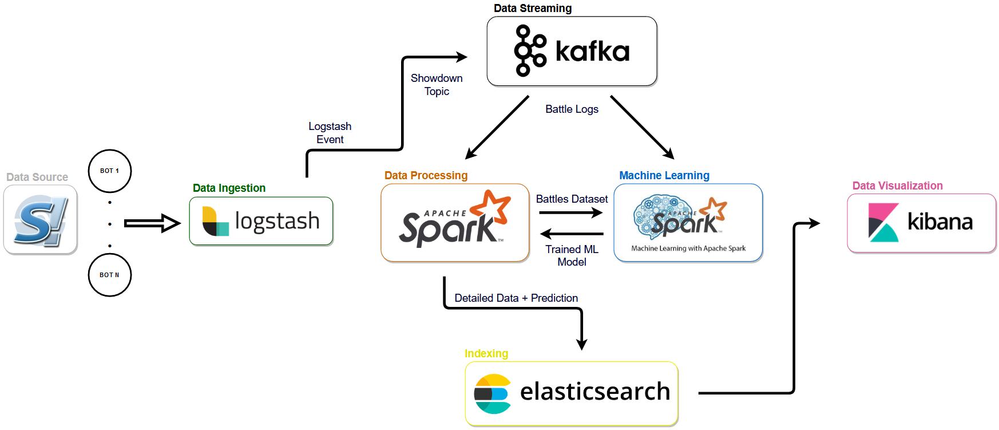

# TAP x Pokemon
Data pipeline from Pokemon Showdown to Kibana for a University Project.

<p align="center"></p>

## Description
The Data Pipeline components are:

- **Docker_sd**: executing one or multiple bots made by pmariglia (https://github.com/pmariglia/showdown).
- **[Logstash](https://www.elastic.co/logstash)**: used to *ingest* data coming from the bots and send data to the showdown kafka topic.
- **[Kafka](https://kafka.apache.org/)**: event *streaming* platform, connects logstash to the Spark processing component.
- **[Spark](https://spark.apache.org/)**: defined as a unified analitycs engine, here it has the job to *process* the incoming data stream, make *predictions* about battle results using the specific **MLlib** library and send all the above to Elasticsearch.
- **[Elasticsearch](https://www.elastic.co/)**: Indexing incoming data.
- **[Kibana](https://www.elastic.co/kibana)**: UI dedicated to Data Visualization.


More technical details in the specific folder, more details on the actual usage in this project in **doc**.

## Requirements
- Docker (Desktop on Windows)
- Docker Compose
- Web Browser

## Usage
First, download or clone the repository using (please rename the directory ```pokemon_tap/``` to avoid docker network inconsistencies):
```
git clone https://github.com/Alemsun/pokemon_tap.git
```
Then move into the folder *pokemon_tap*:
```
cd path/to/pokemon_tap/
```
Run all the docker containers executing the following line (before exectuing, make sure you don't have another docker network with the same name using ``` docker network rm poke ``` and giving execution permission to ```kafka/kafka-manager.sh``` and ```spark/spark-manager.sh```):
```
docker-compose up
```
Finally, after a short period of time, necessary to produce data from the Showdown to Kibana, open a Web Browser and insert the following URL:
```
localhost:5601
```

Feel free to explore and create new visualizations! Or simply import my visualizations located in ```kibana/export.ndjson``` to ```Kibana > Management > Saved Objects > Import```.
